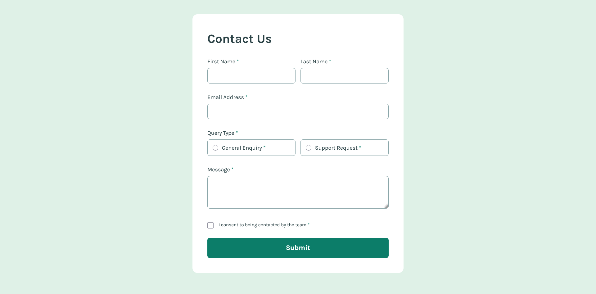

# Frontend Mentor - Contact Form Solution

This is a solution to the [Contact Form challenge on Frontend Mentor](https://www.frontendmentor.io/challenges/contact-form--G-hYlqKJj). Frontend Mentor challenges help you improve your coding skills by building realistic projects. 

## Table of contents

- [Overview](#overview)
  - [The challenge](#the-challenge)
  - [Screenshot](#screenshot)
  - [Links](#links)
- [My process](#my-process)
  - [Built with](#built-with)
  - [What I learned](#what-i-learned)
- [Author](#author)

## Overview

### The challenge

Users should be able to:

- Complete the form and see a **success toast message** upon successful submission.
- Receive **form validation messages** if:
  - A required field has been *missed*.
  - The email address is *not formatted correctly*.
- Complete the form only using their **keyboard**.
- Have inputs, error messages, and the success message announced on their **screen reader**.
- View the **optimal layout** for the interface depending on their device's screen size.
- See **hover and focus states** for all interactive elements on the page.

### Screenshot



### Links

- [Solution](https://github.com/Kking927/contact-form)
- [Live Site](https://kking927.github.io/contact-form/)

## My process

### Built with

- **Semantic HTML5** markup
- **CSS Custom Properties**
- **Flexbox**
- **Mobile-first**
- **Vanilla JavaScript**

### What I learned

During this project, I deepened my understanding of accessible form building and validation. Instead of creating massive, complex validation checks from scratch in JavaScript, I learned how to combine *semantic HTML validation attributes* with the native `checkValidity()` API. 

I also learned how to handle complex *dual-error messaging paths* for a single input (such as an email field being completely empty versus being formatted incorrectly) by dynamically swapping target parent helper classes in CSS.

Here are a few code snippets highlighting how these layers work together:

```html
<fieldset class="form-group query-group">
  <legend>Query Type</legend>
  <div class="radio-option">
    <input type="radio" id="general-enquiry" name="query_type" value="general" required>
    <label for="general-enquiry">General Enquiry</label>
  </div>
  <div class="radio-option">
    <input type="radio" id="support-request" name="query_type" value="support" required>
    <label for="support-request">Support Request</label>
  </div>
  <p class="error-message">Please select a query type</p>
</fieldset>
```
```CSS

/* Toggling overlapping error state visibility explicitly via CSS namespaces */
.form-group.has-error .error-message.empty-error,
.form-group.has-error .error-message.format-error {
  display: none; 
}
.form-group.has-error-empty .error-message.empty-error {
  display: block;
}
.form-group.has-error-format .error-message.format-error {
  display: block;
}
```

```JavaScript

// Using explicit, isolated container loops to check native constraints
const textFields = form.querySelectorAll('input[type="text"], textarea');
textFields.forEach(field => {
  const parent = field.closest('.form-group');
  if (!parent) return;

  if (!field.checkValidity()) {
    parent.classList.add('has-error');
    isFormValid = false;
  } else {
    parent.classList.remove('has-error');
  }
});
```

### Author

- Frontend Mentor - [@Kking927](https://www.frontendmentor.io/profile/Kking927)
